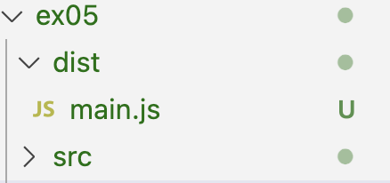
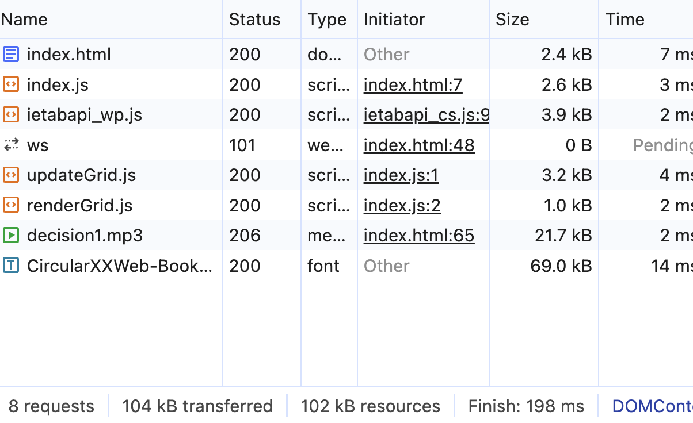
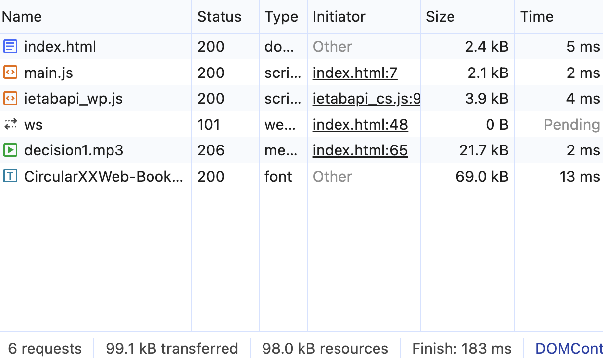

## コードの比較
- `dist`フォルダを作って、index.js, renderGrid.jsとupdateGrid.jsがmain.jsになった

- main.jsには、コードが一行になった
- 変数名はa,b,cのようなアルファベットになった
- `COLS``ROWS`の定数は、数字になって直接に使われた
- インポータされたものは、function()になったみたい、関数の名前も一つのアルファベットになった

## 時間の比較
- バンドル前
  - 
  - およそ200msでロード
  - 8 requests
- ハンドル後
  - 
  - 時間は同じぐらい
  - 6 requests