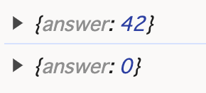
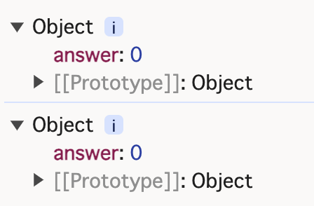

予想した内容:  
`{answer: 42}`  
`{answer: 0}`

実際の内容:  
開発者ツールを開いた状態のタブでHTMLを開く場合:  
  
HTMLを開いた状態のタブで開発者ツールを開く場合:  

 

https://developer.mozilla.org/ja/docs/Web/API/console/log_static より、
>これらのブラウザーで記録されるのはオブジェクトへの参照です。  
>そのため、console.log()を呼び出した時点でのオブジェクトの「値」が表示されるのではなく、内容を見るために開いた時点での値が表示されます。

つまり、HTMLを開いた状態のタブで開発者ツールを開く場合、「内容を見るために開いた時点」はindex.html中のscriptが全部実行済み後で、life内の内容はすでに変わってしまった。そのため、どちらでも0と出力された。

 

https://developer.mozilla.org/ja/docs/Web/API/console/log_static より、
> console.log(obj) を使わず、 console.log(JSON.parse(JSON.stringify(obj))) を使用してください。  

修正として、index2.htmlには、console.log(JSON.parse(JSON.stringify(life)))を使うことになる。