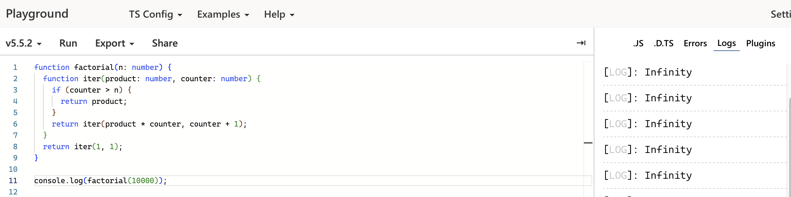

https://ja.wikipedia.org/wiki/%E6%9C%AB%E5%B0%BE%E5%86%8D%E5%B8%B0#cite_note-bit-tango-cho-1 より、\
末尾再帰とは、再帰的な関数やプロシージャにおいて、自身の再帰呼び出しが、その計算における最後のステップになっているような再帰のパターンのことである。\
一般的には、関数再帰のプロセスの中に、関数自身を呼び出すと、関数のローカル変数や戻り先などの情報をスタックに保存する必要がある。しかし、末尾再帰の場合は、戻り先を保存しなくても良い特徴がある。これで、末尾再帰の最適化を実現できる。
 

JavaScriptには、ES6から末尾再帰の最適化が可能になったが、ブラウザにはSafariだけが可能だ。
