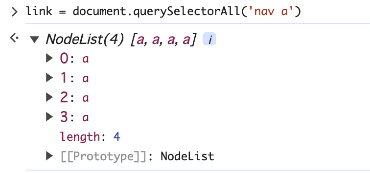
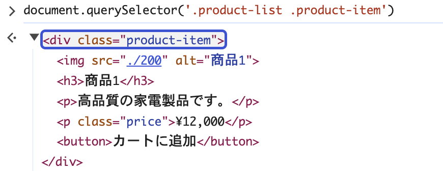
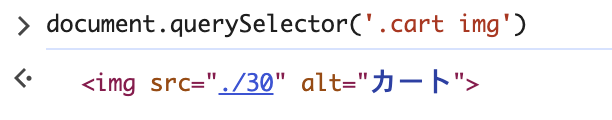
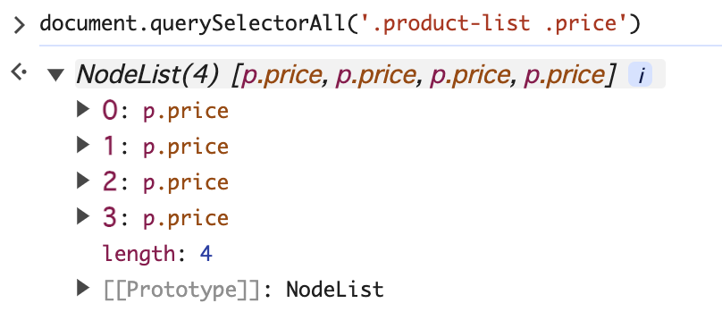
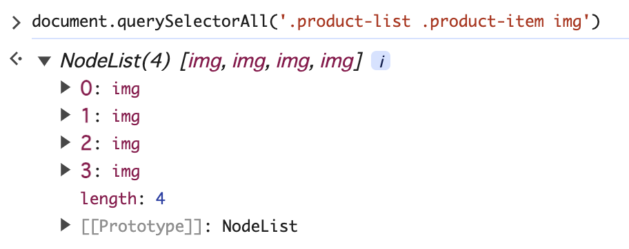
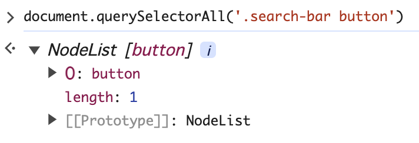
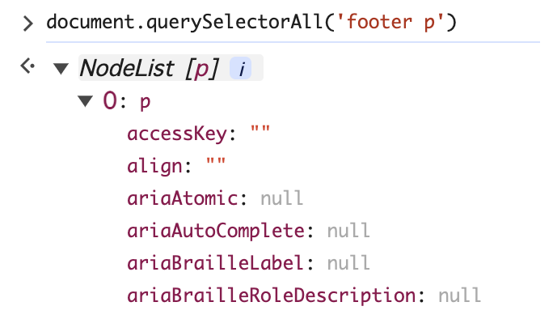
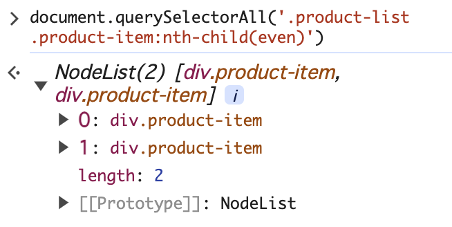
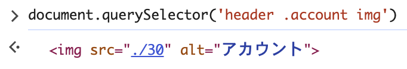
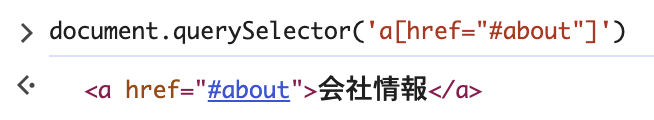

1. nav 要素内のリンク \
`link = document.querySelectorAll('nav a')`

2. 商品リスト (.product-list) 内の最初の商品 (.product-item)\
`document.querySelector('.product-list .product-item')`

3. カートアイコンの画像 ()\
`document.querySelector('.cart img')`

4. 商品リスト (.product-list) 内の価格 (.price) を表示する要素
`document.querySelectorAll('.product-list .price')`

5. 商品リスト (.product-list) 内の全ての商品 (.product-item) の画像
`document.querySelectorAll('.product-list .product-item img')`

6. 検索バー (.search-bar) 内の検索ボタン
`document.querySelectorAll('.search-bar button')`

7. フッター (footer) 内のパラグラフ
`document.querySelectorAll('footer p')`

8. 商品リスト (.product-list) 内の偶数番目の商品 (.product-item)
`document.querySelectorAll('.product-list .product-item:nth-child(even)')`

9. ヘッダー (header) 内のアカウントリンク (.account) の画像
`document.querySelector('header .account img')`

10. ナビゲーションリンクのうち、"会社情報" のリンク
`document.querySelector('a[href="#about"]')`
