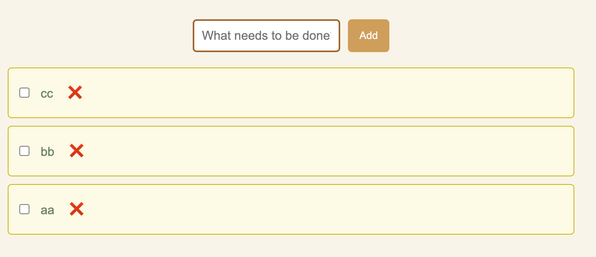

## 1
formに対してdisplayを変更すると、\
変更前
変更後

## 2
- マウスでページ上の要素を選択して、そのCSSを調べることができる。
  - marginやpaddingが見える。
  
  - CSSプロパティの追加や値の変更をできる。
- :hover, :focusなどの指定ができ、その状態のCSSをチェックできる


- Computedには、選択された要素に適用されたスタイルを表示する


## 3
新しいクラスを追加する場合、htmlファイルにそのクラスを追加して、
```
npx tailwindcss -i ./ex02/input.css -o ./ex02/style.css
```
を実行する必要がある。そうしないと、変更が反映されない。\
開発者ツールから新しいクラスを追加しても、その変更が反映されない。

元々にあるクラス`bg-orange-500`をstyle.cssに検索すると、
```
.bg-orange-500 {
  --tw-bg-opacity: 1;
  background-color: rgb(249 115 22 / var(--tw-bg-opacity));
}
```
があるが、`bg-rose-600`がない。
htmlに`bg-rose-600`を追加して再度コマンドを実行した後、style.cssに
```
.bg-rose-600 {
  --tw-bg-opacity: 1;
  background-color: rgb(225 29 72 / var(--tw-bg-opacity));
}
```
というスタイルがある。
