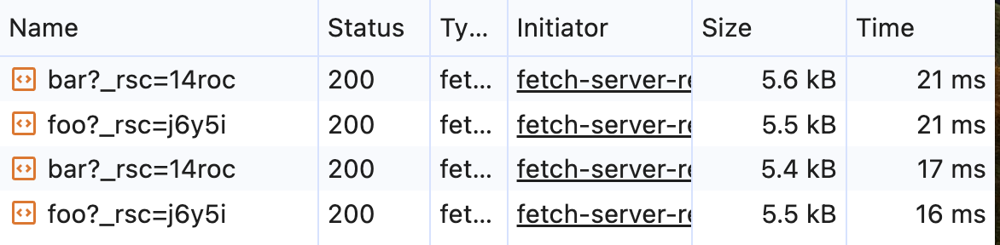
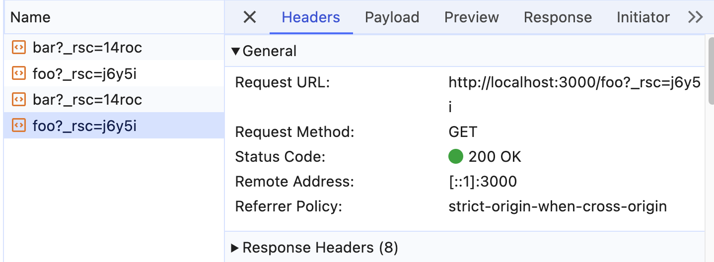

### ブラウザの開発者ツールの「ネットワーク」タブを確認してみよう。リンクをクリックしたときに通信は発生しているだろうか？

- http://localhost:3000/foo に目標ページをリクエストする
- (普段ではページのリロードがないが、ネットワークが切断されるとリロードが発生したみたい)

### pushState はいつ実行されているだろうか？
- リンクをクリックするとき実行される
- (ページを遷移する前に？後に？)

### 15.4-10.12 では pushState を使った実装でページのリロード時に正しく動作しなかったが、この問題ではどうだろうか？
- 15.4-10.12 ではページのリロード時`http://localhost:3000/ch15.04-10/ex12/completed`をリクエストしたが、そのファイルが存在しない。
- `foo/page.tsx`と`bar/page.tsx`が存在しているため、それらのページへのリクエストができる。

