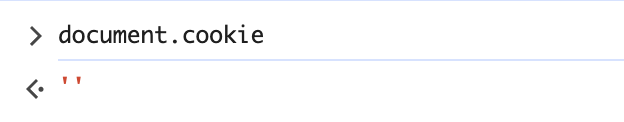
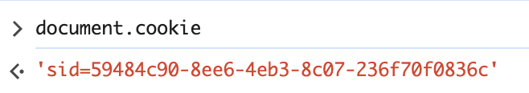
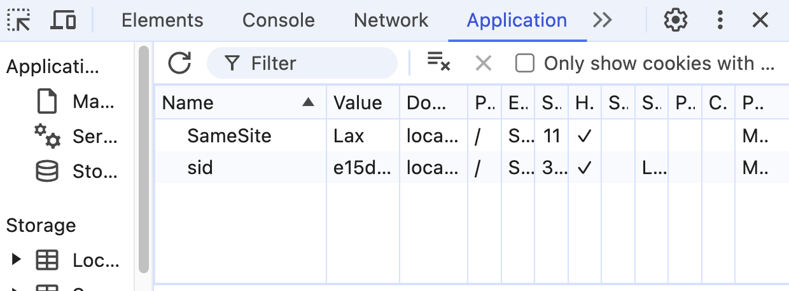

## 1. index.js でdocument.cookie プロパティを console.logで表示する
結果として、何も表示しない。
```
// HttpOnly を有効にしてクライアントの JavaScript から Cookie を参照できない
ようにする
// ので、index.jsからconsole.log(document.cookie)は何も表示しない
    res.setHeader(
        "Set-Cookie",
        `sid=${encodeURIComponent(sid)}; SameSite=Lax; Path=/; HttpOnly;`,
    );
    return true;
```

## 2. ブラウザの開発者コンソールで http://localhost:3000/ の Cookie を表示する
コンソールにdocument.cookieを入力したら、何も出力しない

1と同じ原因だと思う。`HttpOnly`を削除すると、出力できた


## 3. ToDo アプリのタブをリロードする
すでに入力されたタスクとそれぞれの状態が保留され、リロードしても変わらない\
理由：cookieにはセッションに対して ID を付与し、sidでセッション毎に Task API のデータを分離する。
リロードする時、cookieにあるsidですでに入力されたタスクを取り出す

にあるsidを削除すると、リロードすると入力されたタスクが消える

## 4. 同一ブラウザの異なるタブやウィンドウで http://localhost:3000/ を開いて ToDo リストの状態を確認する
すでに開かれたタブと同じ内容が表示される\
理由：同一ブラウザの異なるタブやウィンドウでは、cookieが同じで、同じsidで同じタスクリストを取り出す

## 5. シークレットウィンドウや異なるブラウザで http://localhost:3000/ を開いて ToDo リストの状態を確認する
タスクリストには何もない\
理由：すでに開かれたウィンドウと異なるセッションになり、sidも違う

## 6. http://127.0.0.1:3000/ を開いて ToDo リストの状態を確認する
タスクリストには何もない\
理由：
http://127.0.0.1:3000/ と http://localhost:3000/ は異なるドメインと扱われるため、異なるセッションになり、sidも違う