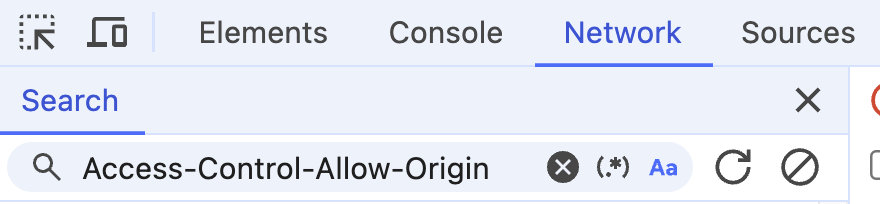
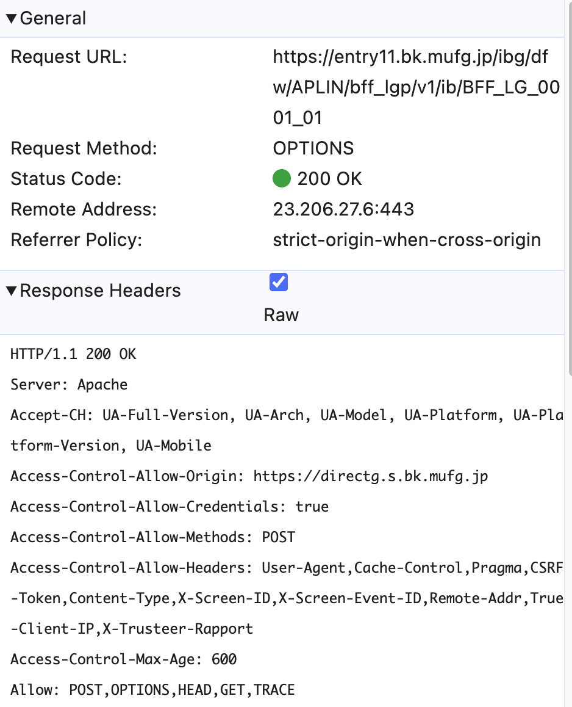
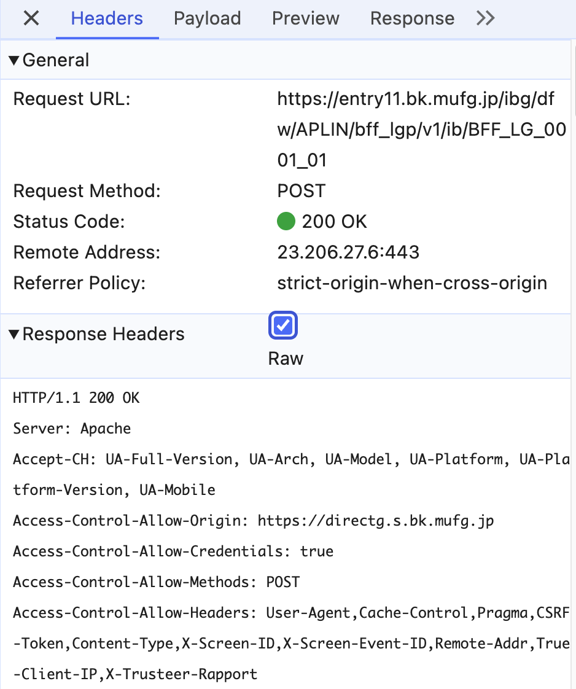
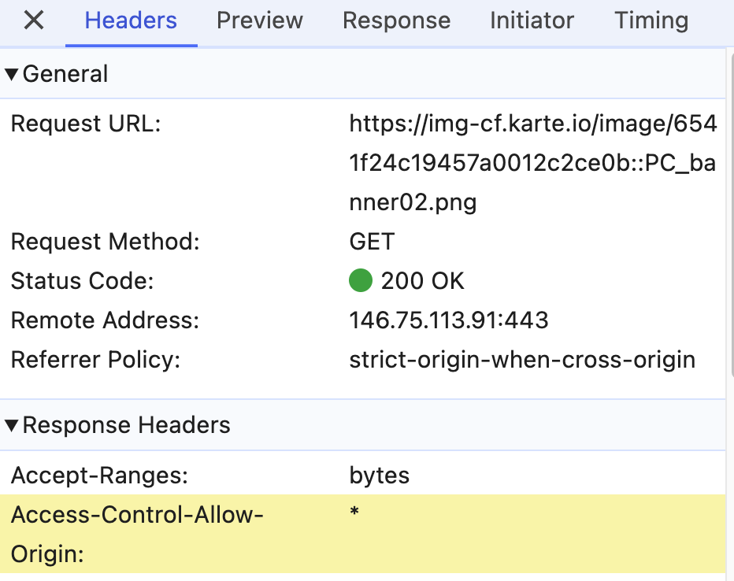
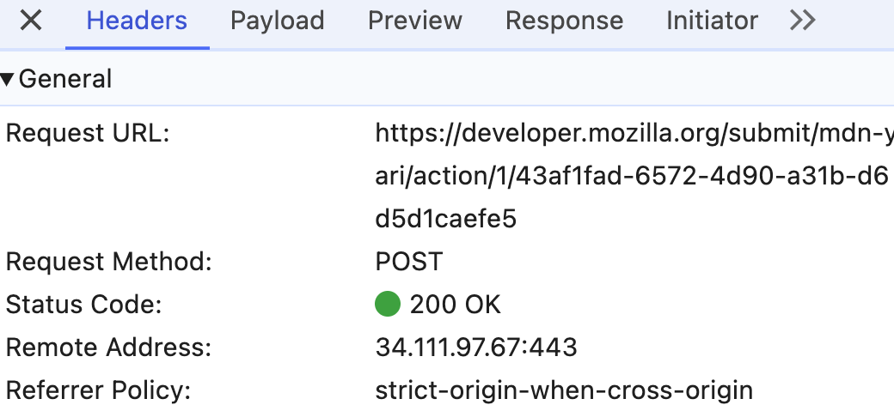
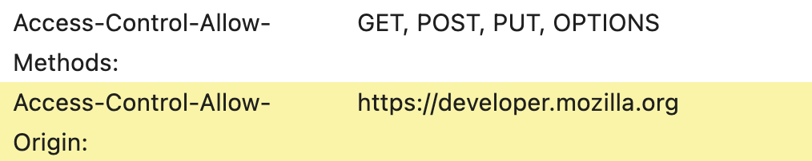

- 確認方法：レスポンスヘッダーに`access-control-allow-origin`を探す
で`access-control-allow-origin`を検索
- 三菱UFJダイレクトのログイン画面
  - ページURL：https://directg.s.bk.mufg.jp/APL/LGP_P_01/PU/LG_0001/LG_0001_PC01?link_id=direct_leftmenu_login_PC&_gl=1*bxrm52*_gcl_au*Nzg1OTYxNDA0LjE3MzMxMDg2NzU.
  - Networkタブには、二つの通信には`Access-Control-Allow-Origin: https://directg.s.bk.mufg.jp`がある
  - 
  - 
  - 他の通信に、`Access-Control-Allow-Origin: *`もある、ただの画像を取得するリクエストみたい
  
- MDNドキュメント
  - https://developer.mozilla.org/ja/docs/Web/HTTP/Headers/Access-Control-Allow-Origin
  - いくつかのリクエストには、`access-control-allow-origin:https://developer.mozilla.org`がある
  - 
  - それらのリクエストURLには、submitという文字がある
