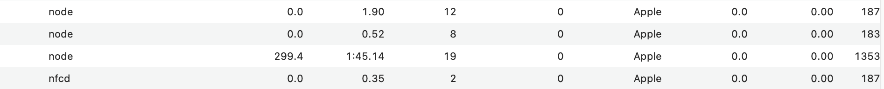

https://e-words.jp/w/%E3%83%9E%E3%83%AB%E3%83%81%E3%82%B9%E3%83%AC%E3%83%83%E3%83%89.html
- マルチスレッド（multi-thread）とは、一つのコンピュータプログラムを実行する際に、複数の処理の流れを並行して進めること。また、そのような複数の処理の流れ。

### スレッド数変更して実行
- 項数は45、スレッドは1
```
Worker 0 execution time: 11.627s
Total execution time: 11.629s
Fibonacci number: 1836311902
```
- 項数は45、スレッドは2
```
Worker 0 execution time: 4.595s
Worker 1 execution time: 7.374s
Total execution time: 7.376s
Fibonacci number: 1836311902
```
- 項数は45、スレッドは3
```
Worker 2 execution time: 2.442s
Worker 0 execution time: 3.871s
Worker 1 execution time: 6.101s
Total execution time: 6.102s
Fibonacci number: 1836311902
```
- 項数は45、スレッドは4
```
Worker 2 execution time: 1.378s
Worker 1 execution time: 2.186s
Worker 0 execution time: 3.427s
Worker 3 execution time: 5.427s
Total execution time: 5.429s
Fibonacci number: 1836311902
```
- 項数は45、スレッドは5
```
Worker 3 execution time: 910.218ms
Worker 2 execution time: 1.370s
Worker 1 execution time: 2.166s
Worker 0 execution time: 3.384s
Worker 4 execution time: 5.276s
Total execution time: 5.279s
Fibonacci number: 1836311902
```
- 項数は45、スレッドは8
```
Worker 5 execution time: 309.067ms
Worker 2 execution time: 399.576ms
Worker 0 execution time: 620.533ms
Worker 6 execution time: 975.53ms
Worker 3 execution time: 1.387s
Worker 7 execution time: 2.116s
Worker 1 execution time: 3.210s
Worker 4 execution time: 4.954s
Total execution time: 4.956s
Fibonacci number: 1836311902
```
- 項数は45、スレッドは16
```
Worker 8 execution time: 98.284ms
Worker 3 execution time: 100.53ms
Worker 0 execution time: 101.595ms
Worker 13 execution time: 104.159ms
Worker 14 execution time: 162.894ms
Worker 11 execution time: 171.284ms
Worker 4 execution time: 230.323ms
Worker 7 execution time: 286.014ms
Worker 15 execution time: 394.243ms
Worker 5 execution time: 462.928ms
Worker 6 execution time: 750.966ms
Worker 9 execution time: 1.004s
Worker 1 execution time: 1.461s
Worker 10 execution time: 2.178s
Worker 2 execution time: 3.250s
Worker 12 execution time: 4.931s
Total execution time: 4.934s
Fibonacci number: 1836311902
```

### OS機能
- アクティビティモニタで確認
  - 二つの空きているそうなnodeがある
  - スレッド数はパラメータ+11?
- 項数は50、スレッドは1
![alt text]

- 項数は50、スレッドは2


- 項数は50、スレッドは3


- 項数は50、スレッドは4


- 項数は50、スレッドは8


### CPUスペック
- Apple M2
  - https://support.apple.com/ja-jp/111869より
  - 4つの高性能コアと4つの高効率コアを搭載した8コアCPU
- 適切なスレッド数は4または8?

